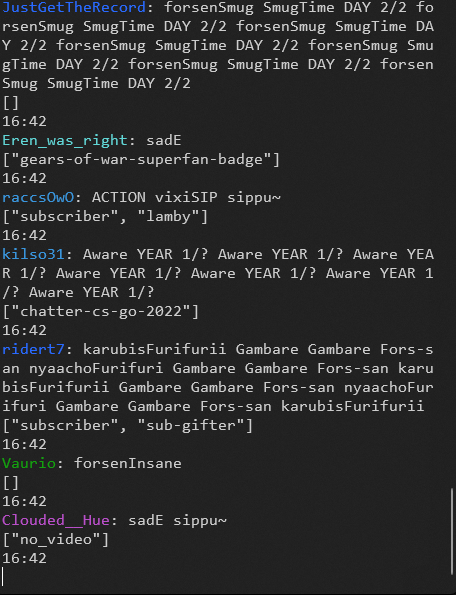

# TWITCH WEB SOCKET

<https://dev.twitch.tv/docs/chat/irc/#privmsg-tags>

TODO

- REMOVE EVERYTHING FROM `main.rs`, I'm just leaving all in there just for learning

- Verify if token is valid
- Send message concurrently to chat messages
- Handle multiple channels
- Handle "ACTION" `PleaseEndMyLoniness: ACTION a`
